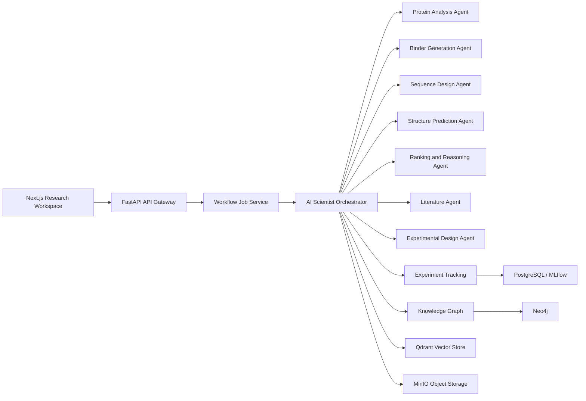

# OpenBioDesign Platform

OpenBioDesign is an open-source, research-grade scaffold for an explainable AI-assisted protein binder design platform. It wraps the original NVIDIA BioNeMo blueprint concepts with auditable APIs, provenance-first experiment tracking, scientific agent contracts, and open infrastructure.

This implementation is intentionally model-adapter driven. The default workflow uses deterministic baseline agents so the platform can be tested without GPU services. Production deployments should replace those adapters with RFdiffusion, ProteinMPNN, OpenFold, ESMFold, DiffDock, Neo4j, Qdrant, MLflow, and object storage implementations.

## Current Capabilities

- FastAPI gateway with versioned API routes.
- Typed domain models for targets, candidates, evidence, provenance, uncertainty, and experiment records.
- Orchestrated binder-design workflow with auditable agent steps.
- Deterministic baseline scientific agents for local testing.
- Durable job records with a CPU-friendly local queue for deterministic workflow execution.
- SQL-backed experiment, artifact, audit, identity, and job repositories.
- Security primitives for bearer API keys, hashed persisted API keys, project RBAC, and audit logs.
- Scientific evidence clients for UniProt, RCSB/PDB, AlphaFold DB, and Europe PMC.
- Bounded retry and local cache behavior for scientific source lookups.
- Tests covering reproducibility, explainability, validation, and API behavior.
- Open-source local compose file for PostgreSQL, Redis, Neo4j, Qdrant, MinIO, Prometheus, Grafana, and MLflow-compatible tracking.

## Run Locally

```bash
cd platform/backend
python -m venv .venv
.\.venv\Scripts\Activate.ps1
pip install -e ".[dev]"
uvicorn openbiodesign.main:app --reload --port 8080
```

API docs will be available at `http://127.0.0.1:8080/docs`.

## Run Tests

```bash
cd platform/backend
pip install -e ".[dev]"
pytest
```

## Example Request

```bash
curl -X POST "http://127.0.0.1:8080/api/v1/workflows/binder-design/jobs" \
  -H "Authorization: Bearer dev-scientist-key" \
  -H "Content-Type: application/json" \
  -H "Idempotency-Key: demo-insulin-42" \
  -d '{
    "project_id": "demo-project",
    "target": {
      "accession": "P01308",
      "name": "Insulin",
      "sequence": "MALWMRLLPLLALLALWGPDPAAAFVNQHLCGSHLVEALYLVCGERGFFYTPKT"
    },
    "hypothesis": "Generate explainable binder candidates for demonstration.",
    "requested_candidates": 3,
    "random_seed": 42
  }'
```

Check job status:

```bash
curl "http://127.0.0.1:8080/api/v1/jobs/<job_id>" \
  -H "Authorization: Bearer dev-viewer-key"
```

The deterministic local worker runs without GPU services or model downloads. Real model adapters
should be added behind this job boundary later.

## Architecture



## Production Notes

- Replace `InMemoryExperimentRepository` and `InMemoryKnowledgeGraph` before production use.
- Configure OAuth2/OIDC and short-lived JWT validation instead of development bearer keys.
- Store all artifacts in immutable object storage with content hashes.
- Capture model image digest, code commit, data source versions, seeds, hardware, and environment metadata for every run.
- Never present generated binders as validated therapeutics. Outputs are computational hypotheses requiring wet-lab validation.
